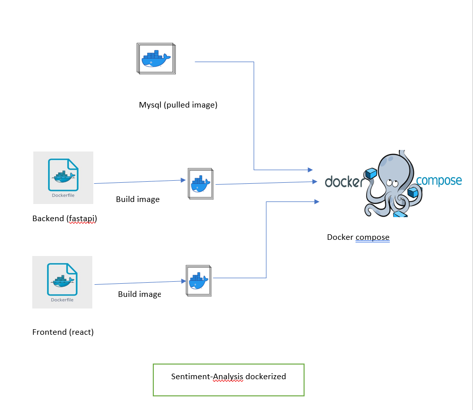

# Dockerization Process - Sentiment Analysis API

This document provides a comprehensive guide to the dockerization process of the Sentiment Analysis API application. The application uses Docker and Docker Compose to containerize both the backend FastAPI service and the React frontend, along with a MySQL database.

## Table of Contents
- [Overview](#overview)
- [Architecture](#architecture)
- [Services](#services)
- [Setup Instructions](#setup-instructions)
- [Running the Application](#running-the-application)
- [Container Configuration](#container-configuration)
- [Networking](#networking)
- [Volumes & Data Persistence](#volumes--data-persistence)
- [Demo Video](#demo-video)

---

## Overview

The application employs a **multi-container Docker architecture** that ensures:
- **Isolation**: Each service runs in its own container
- **Scalability**: Easy to scale and manage services independently
- **Consistency**: Same environment across development, testing, and production
- **Simplicity**: Single command to start the entire application stack


 
## Services

### 1. **MySQL Database Service**
- **Image**: `mysql:8.0`
- **Container Name**: `mysql`
- **Port**: `3306` (exposed on host)
- **Database**: `sentiment_db`
- **Default User**: `sentiment_user` / `sentiment_pass`
- **Root Password**: `rootpassword`
- **Features**:
  - Automatic restart on failure
  - Data persistence via named volume `mysql_data`
  - Native password authentication plugin

### 2. **Backend Service (FastAPI)**
- **Image**: `sentiment-backend:v1.0.0`
- **Container Name**: `sentiment-backend`
- **Port**: `8000` (exposed on host)
- **Build Directory**: `./app/`
- **Dependencies**: 
  - Python 3.9
  - FastAPI framework
  - MySQL client libraries
  - ML model dependencies (PyTorch, scikit-learn, etc.)
- **Features**:
  - Automatic restart on failure
  - Depends on MySQL service
  - Environment variables for database configuration

### 3. **Frontend Service (React)**
- **Image**: `sentiment-frontend:v1.0.0`
- **Container Name**: `sentiment-frontend`
- **Port**: `81` (mapped from container port 3000)
- **Build Directory**: `./frontend/`
- **Dependencies**:
  - Node.js 20 Alpine
  - React 18+
- **Features**:
  - Automatic restart on failure
  - Depends on backend service
  - Hot module reloading support

---

## Setup Instructions

### Prerequisites
- Docker Desktop installed and running
- Docker Compose (included with Docker Desktop)
- Git (for cloning the repository)
- At least 4GB of free disk space

### Step 1: Clone the Repository
```bash
git clone https://github.com/GitHubmedcharfi/sentiment-analysis-api.git
cd api_sentiment
```

### Step 2: Prepare Environment Variables
The application uses environment variables defined in the `docker-compose.yml` file. Default values are:

**Database Configuration**:
- `MYSQL_ROOT_PASSWORD`: rootpassword
- `MYSQL_DATABASE`: sentiment_db
- `MYSQL_USER`: sentiment_user
- `MYSQL_PASSWORD`: sentiment_pass

**Backend Configuration**:
- `MYSQL_HOST`: mysql (resolved by Docker network)
- `MYSQL_USER`: sentiment_user
- `MYSQL_PASSWORD`: sentiment_pass
- `MYSQL_DB`: sentiment_db

**Frontend Configuration**:
- `REACT_APP_API_BASE_URL`: http://localhost:8000
- `REACT_APP_WS_URL`: ws://localhost:8000/ws

### Step 3: Build Docker Images
```bash
# Build all images from docker-compose.yml
docker-compose build
```

This will build:
- Backend image from `app/Dockerfile`
- Frontend image from `frontend/Dockerfile`
- Automatically pull MySQL image

---

## Running the Application

### Start All Services
```bash
docker-compose up -d
```

The `-d` flag runs containers in detached mode (background).

### View Running Containers
```bash
docker-compose ps
```

Expected output:
```
NAME                   COMMAND                  SERVICE      STATUS
mysql                  "docker-entrypoint..."   mysql        Up 2 minutes
sentiment-backend      "./entrypoint.sh"        backend      Up 2 minutes
sentiment-frontend     "npm start"              frontend     Up 2 minutes
```

### Access the Application
- **Frontend**: http://localhost:81
- **Backend API**: http://localhost:8000
- **API Documentation**: http://localhost:8000/docs
- **Database**: localhost:3306 (use MySQL client)

### View Logs
```bash
# View logs from all services
docker-compose logs -f

# View logs from specific service
docker-compose logs -f backend
docker-compose logs -f frontend
docker-compose logs -f mysql
```

### Stop All Services
```bash
docker-compose down
```

### Stop and Remove Volumes
```bash
# Warning: This deletes the database!
docker-compose down -v


